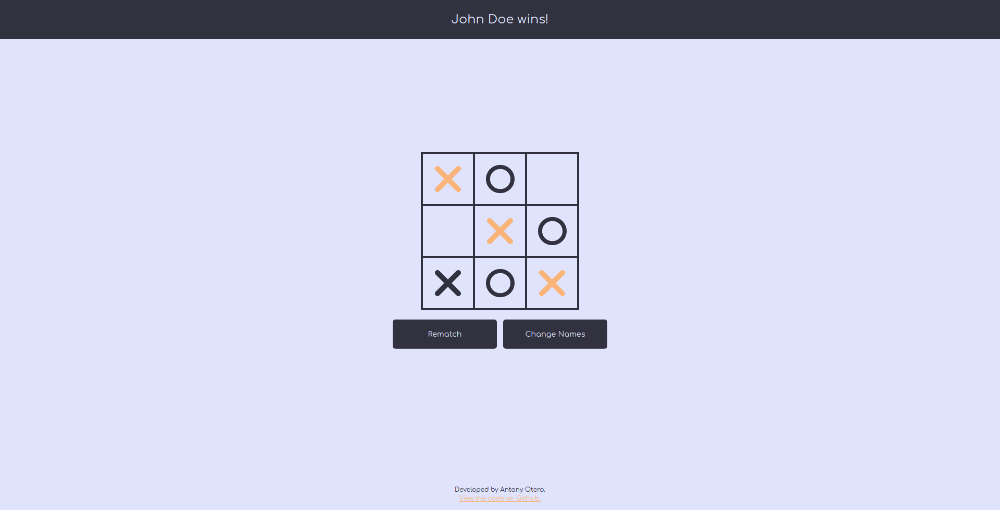

# Tic-Tac-Toe

> A Tic-Tac-Toe game you can play in the browser. This implementation is written in vanilla JavaScript, with no additional libraries. The goal of this project was to avoid polluting the global space by using factory functions and the module pattern. In its current iteration, the game does not have an AI competitor as it was an optional assignment of the project and I didn't want to spend longer than the time I had allocated to complete the project.

 The project allows two players to enter custom usernames then begins a game of Tic-Tac-Toe. At the end of the game, a banner is displayed announcing the winner or declaring a draw. If there is a winner, the winning tokens are highlighted on the board. The players can then have a rematch or change their usernames.

## Built With

- JavaScript
  - Factory Functions
  - The Module Pattern

## Live Demo

[Live Demo Link](https://antonyotero.github.io/tic-tac-toe/)

## Authors
👤 **Antony Otero**

- GitHub: [@AntonyOtero](https://github.com/AntonyOtero)
- Twitter: [@AntonyOtero](https://twitter.com/AntonyOtero)
- LinkedIn: [antonyotero](https://www.linkedin.com/in/antonyotero/)

## 🤝 Contributing

Contributions, issues, and feature requests are welcome!
Feel free to check the [issues page](https://github.com/AntonyOtero/antonyotero/issues).

## Show your support

Give a ⭐️ if you like this project!

## Acknowledgments

- [The Odin Project](https://github.com/TheOdinProject)

## 📝 License

This project is [MIT](LICENSE) licensed.
